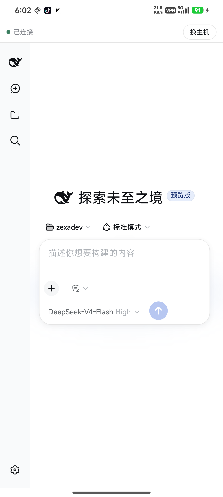
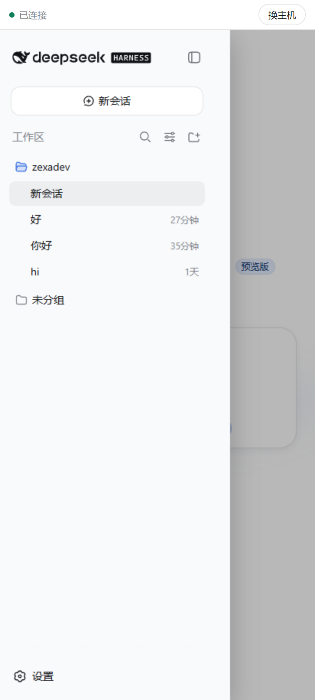
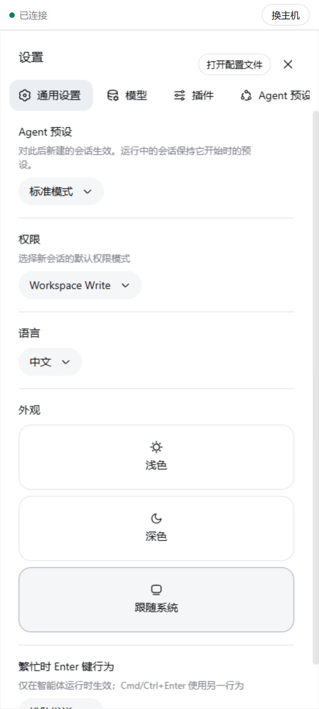
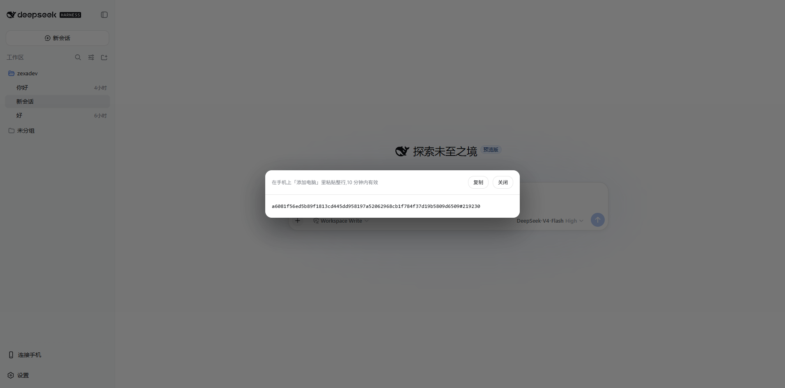
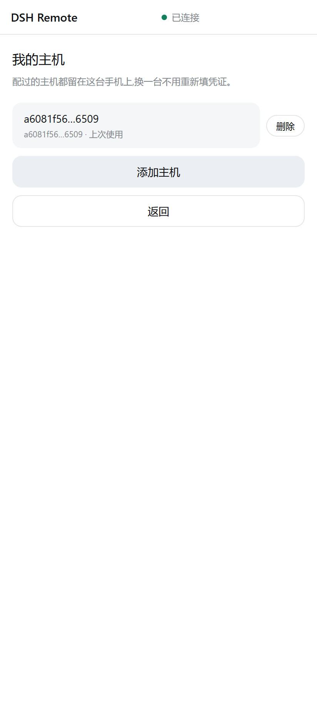

<p align="center"></p>

<h1 align="center">DSH Tether</h1>

<p align="center">
  
  为 <a href="https://github.com/deepseek-ai/deepseek-harness">DeepSeek Harness</a> 打造的第三方社区项目 · 非官方
</p>

<p align="center">
  
  
  
</p>

[English](README.md)

**在手机上用你开发机里的 DeepSeek Harness。跨网络,中间不经过任何服务器。**

agent 依旧跑在你代码所在的那台电脑上。手机拿到的是 DSH 自己的完整界面,经 P2P 直连送过来——用 6 位码配对一次,之后两端在哪个网络都能互相找到。

## 它解决什么

**你不在电脑那个网络里,又不想中间有一台服务器。**

手机连回自己开发机,常见做法要么要求两端在同一个局域网,要么要求你部署并信任一台中转。这个项目两样都不要:两端靠 [iroh](https://www.iroh.computer/) 直接打洞,打通后流量不经过任何第三方;打不通才退回 relay,而 relay 上过的也只是它读不懂的密文。

如果你只在和电脑同一个 WiFi 下用手机,你并不需要这些——局域网方案更简单。

## 长什么样

<p align="center">
  
  
  
</p>

手机上跑的就是 DSH 自己的界面,不是另做一套:会话、工具调用、审批、设置全都在。窄屏下做了适配——侧栏改成抽屉覆盖、设置页导航横排、内容占满整宽。

## 安装

### 1. 电脑上装插件

```sh
dsh plugin --profile web add github:zexadev/dsh-tether
```

插件要带一个 Rust 写的 sidecar,它负责 iroh 连接。**平台二进制目前随 [Release](../../releases) 分发,还没发到 npm**,所以要再装一步——下载对应平台的 `dsh-tether-host-<平台>-<版本>.tgz`,然后:

```sh
dsh plugin --profile web add ./dsh-tether-host-win32-x64-0.1.0.tgz
```

也可以直接从源码构建(需要 Rust):

```sh
git clone https://github.com/zexadev/dsh-tether && cd dsh-tether
cargo build --release -p tether-host
dsh plugin --profile web add .
```

### 2. 手机上装 App

从 [Release](../../releases) 下载 `app-universal-release.apk`。已签名,直接安装。

### 3. 配对

电脑上照常启动:

```sh
dsh web
```

在侧栏底部点**「连接手机」**,会给出一行配对串:

<p align="center"></p>

手机上打开 DSH Tether →「添加电脑」→ 把那一整行粘进去 → 给这台电脑起个名字 → 连接。

之后每次打开 App 自动连上,不用再配对。

## 换手机、加第二台设备

电脑侧栏的**「连接手机」**随时能出一个新配对码,10 分钟有效。

手机侧栏底部的**「我的电脑」**是你自己的页面:配过的电脑都在这儿,可以切换、改名、删除,也能添加新的——换一台不用重新填凭证。

<p align="center"></p>

## 通知

agent 卡在等你批准时,手机会推一条系统通知。批准本身在 DSH 自己的界面里点——本插件刻意不代答审批,只把「它在等你」送到锁屏上。这是口袋里的网页自己做不到的一件事。

## 安全

- 配对码是 6 位随机数(CSPRNG),10 分钟有效,每个窗口只许试 3 次。配对之后凭手机的 iroh 公钥授权,那是 TLS 验证过的,伪造不了。
- 未配对方够不到你的界面:代理流只在完成控制流握手的连接上提供,未配对连接首行最多 512 字节就被拒。
- 流量由 iroh 端到端加密(QUIC/TLS)。打洞成功时不经过任何第三方;退回 relay 时,relay 上过的也只是它读不懂的密文。
- 插件自己那两条 HTTP 路由套了与 dsh `/api` 同一套浏览器信任判据:Host 必须是回环权威,跨站标记一律拒,带 Origin 时必须与 Host 同源。恶意网页的跨站请求和 DNS 重绑定都会拿到 403。
- **已知边界**:上面那套判据防的是浏览器被当枪使,**挡不住本机进程**。本机进程的 Host 就是回环,能取到一个配对码,进而把自己配成一台「手机」。也就是说,**已经能在你开发机上执行代码的攻击者,可以借此拿到长期访问权**。若你的机器上会跑不受信任的代码,别用这个插件。

## 已知限制

- 只有 Android。iOS 暂不做。
- App 打开时才连接,不在后台常驻——Android 的 doze 也留不住它。
- 手机上的界面是 DSH 自己的,窄屏适配靠注入的最小样式完成;dsh 改版式时可能需要跟进。
- 已针对 dsh **`0.1.0-rc.7`** 验证。dsh 处于 developer preview,换更新的 dsh 之前先看这一行。

## 验证过什么

跨网直连是这个项目的立意,所以给证据而不是给说法。手机关掉 WiFi 只走 5G、电脑在家宽,插件侧输出:

```
[tether] 手机已连接: 我的手机
[tether] 连接路径: P2P 直连(NAT 打洞成功) Ip(…:41341)
```

选中路径是公网地址,说明两端是打洞打通的,relay 全程没用上。上面第一张截图就是手机在这条路径上渲染的 DSH 界面——状态栏没有 WiFi 图标。

配对(含错码被拒)、审批送达、多设备切换都在真机上验证过。**打洞失败退回 relay 这条路径,尚未在真实网络下触发过。**

## 从源码构建

需要 Node ^22.19 || >=24、Rust;构建 APK 另需 JDK 21 与 Android SDK/NDK(Windows 上可用 `scripts/setup-android-env.ps1` 装齐)。

```sh
cargo build --release -p tether-host          # 电脑侧 sidecar
cd app && pnpm install
pnpm exec tauri android build --apk --target aarch64
```

## 许可证

MIT
