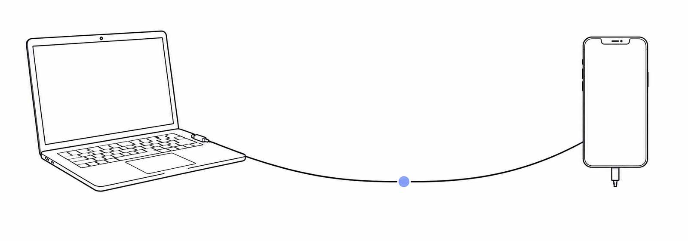

<p align="center"></p>

<h1 align="center">DSH Tether</h1>

[English](README.md)

**在手机上连回你开发机上的 DeepSeek Harness —— 跨网络,不经过任何服务器。不用配 relay,不用同一个 WiFi,不用 Termux。**

agent 留在你代码所在的那台机器上跑。手机拿到的是真东西:DSH 自己的 web 界面,经 P2P 直连送过来([iroh](https://www.iroh.computer/):NAT 打洞,打不通才退回 relay)。用 6 位码配对一次,之后两端在哪个网络都能互相找到。

> 状态:能用,尚早。传输层的跨网能力已验证,具体验到哪一步见 [实测](#实测)。

## 和别的客户端有什么不同

DSH 的手机客户端已经有九个。除了这个,另外两个值得你知道,也该知道什么时候该选它们:

- **[sorsama/deepseek-harness-mobile](https://github.com/sorsama/deepseek-harness-mobile)** —— Kotlin/Compose 写的成熟客户端,功能比这个全,还有 11 种语言。**如果你只在和电脑同一个 WiFi 下用手机,请直接用它。** 它自己的 README 就写明范围是局域网。
- **[april-jk/dsh-mobile-plugin](https://github.com/april-jk/dsh-mobile-plugin)** —— 同样是插件形态的架构,跨网也确实能用。区别在于它要过一台 relay:得你自己部署、配置,并且信任它。

这个项目只解决剩下那种情况:**你不在电脑那个网络里,又不想中间有一台服务器。**

## 工作方式

```
[Android · Tauri 2]                          [你的开发机]
 WebView  ─── http://127.0.0.1:<端口> ─┐      dsh web
 (DSH 自己的 web UI)                   │       └─ dsh-plugin-tether
 iroh 客户端 ──── P2P 直连 ────────────┴──────────  (Cordis 插件,内嵌 iroh)
```

插件就是一个普通 DSH 插件:`dsh` 本身原样运行,插件走官方组合机制接入。它从 `ctx.webServer` 读到 web 服务的真实监听端口,所以没有任何东西要你配。手机每开一条 TCP 就对应同一条 iroh 连接上的一条流,界面的 HTTP 请求和 WebSocket 事件下行因此多路复用、互不队头阻塞。

审批由手机上那个 DSH 自己的 web UI 回答——本插件**刻意不认领**,只观察,好让 App 在 agent 等你的时候推一条**系统通知**。这恰恰是口袋里的 web UI 自己做不到的一件事。

## 安全

- 配对码是 6 位 CSPRNG 随机数,10 分钟有效,每个窗口只许试 3 次。配对之后凭手机的 iroh 公钥(由 iroh 的 TLS 验证,伪造不了)授权。
- 未配对方够不到代理面:代理流只在已完成控制流握手的连接上提供,未配对连接首行最多 512 字节就会被拒。
- 流量由 iroh 端到端加密(QUIC/TLS);打洞成功时不经过任何第三方,退回 relay 时中转的也只是它读不懂的密文。
- App 只对 `127.0.0.1` 放行明文 HTTP —— 那是隧道的本地一端,不是网络。
- 插件自己那两条路由(查看配置文件、按需取配对码)套了与 dsh `/api` 同一套浏览器信任判据:Host 必须是回环权威,跨站标记一律拒,带 Origin 时必须与 Host 同源。恶意网页的跨站请求和 DNS 重绑定都会拿到 403。
- **已知边界**:那套判据防的是浏览器被当枪使,**挡不住本机进程** —— 本机 `curl` 的 Host 就是回环,能取到一个配对码,进而把自己配成一台"手机"。也就是说:**在你的开发机上已经能执行代码的攻击者,可以借此拿到长期访问权**。要堵死需要让配对码只出现在终端、不经 HTTP 返回;当前为了电脑端能一键复制而没有这么做。若你的机器上会跑不受信任的代码,别用这个插件。

## 安装

### 电脑侧(插件)

```sh
dsh plugin --profile web add github:zexadev/dsh-tether
dsh web                                    # 会打印配对串
```

`dsh plugin` 直接把参数转发给 pnpm,所以 npm 包名、`github:` 规格、本地路径都能装。

sidecar 是个 Rust 二进制,按平台拆成 `dsh-tether-host-<平台>` 子包由主包自动引入(和 dsh 自己的 `node-addon-landlock-run` 同款结构)。**目前只发布了 win32-x64**;其它平台请先从源码构建:

```sh
git clone https://github.com/zexadev/dsh-tether && cd dsh-tether
cargo build --release -p tether-host       # 插件会回退到这个产物
dsh plugin --profile web add .
```

### 手机侧

装 Release 里的 APK,打开后把 `dsh web` 打印的配对串(`<主机ID>#<配对码>`)整行粘进去。

从源码构建 APK 需要 Node ^22.19 || >=24、Rust、JDK 21 + Android SDK/NDK(Windows 上可用 `scripts/setup-android-env.ps1` 装齐):

```sh
cd app && pnpm install
pnpm exec tauri android build --apk --target aarch64
```

然后打开 App,把 `dsh web` 输出里的配对串(`<主机ID>#<配对码>`)整体粘进去,你电脑上的 DSH 就出现在手机上了。

## 实测

针对 dsh **`0.1.0-rc.7`** 验证(生态已经分叉:桌面版 pin rc.7,april-jk pin rc.6,本项目是 rc.7)。

| | |
|---|---|
| 配对、错码/对码、白名单持久化 | ✅ 真机 |
| App 内渲染完整 DSH web UI | ✅(`__DSH_BOOT__` 就位,真实会话内容) |
| WebSocket 事件下行经 iroh | ✅ 持有 60s、空闲 5min,与直连一致 |
| HTTP 延迟 / 20 路并发 | ✅ 21ms、20/20 |
| 审批送达手机、agent 继续 | ✅ 真机 |
| **跨网络(手机关 WiFi 走 5G ↔ 电脑家宽)** | ✅ **真机,NAT 打洞直连,未走 relay** |

最后一行是整个项目的立意所在,所以给证据而不是给说法。手机 WiFi 关掉(`wifi_on=0`,状态栏只剩 5G)、电脑在家宽,插件侧输出:

```
[tether] 手机已连接: 我的手机
[tether] 连接路径: P2P 直连(NAT 打洞成功) Ip(152.67.154.117:41341)
```

选中路径是一个公网地址,说明两端是打洞打通的,relay 全程没用上。(手机还开着 VPN,所以对端地址是它的 VPN 出口——结论不变:两个不同的网络,中间没有服务器。)手机在这条路径上完整渲染了 DSH 界面,见 [`assets/phone-cellular.png`](assets/phone-cellular.png)。

## 已知限制

- 只有 Android。iOS 暂不做。
- App 是打开时连接,不在后台常驻(Android doze 也留不住)。
- debug 版 APK 很大,因为保留了调试符号;正常体积请构建 `--release`。
- web UI 是 DSH 的桌面布局,手机上能用但没适配过;要适配也是注入最小 CSS,绝不重写 DSH 的界面。

## 许可证

MIT
